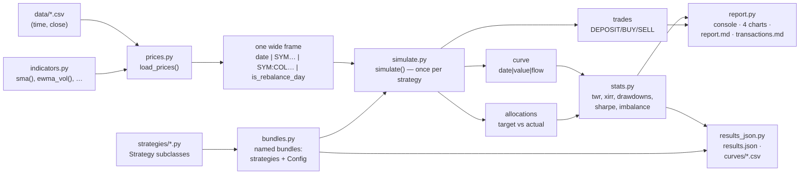

# Architecture

This program backtests monthly-rebalanced, integer-share portfolio strategies
(Shannon's Demon style) against daily close prices, with a fixed monthly capital
contribution, and compares every strategy side by side — including an
invest-the-same-cash-flows-into-SPY benchmark. The product rules (rebalancing,
cash handling, statistics definitions) live in the top-level `README.md`; this
document explains how the code is built and why.

Guiding principle (from `CLAUDE.md`): minimum code that solves the problem. Flat
modules instead of a package hierarchy, plain dataclasses and Polars frames
instead of a domain model, assertions instead of error handling for states the
program itself must never produce. The program is a script
(`uv run main.py [bundle]`), not a library.

## Data flow



`main.py` wires the pipeline: it looks up the bundle named on the command line
(default `default`), collects which symbols the bundle's strategies trade and
which they merely read, loads one shared prices frame, runs the engine once per
strategy under the bundle's `Config`, and hands a list of per-strategy results
to the report layer.

## prices.py — one wide frame per run

`load_prices(data_dir, symbols, start, extra=(), indicators={}) -> pl.DataFrame`
returns a single wide frame: `date` (pl.Date, ascending), one Float64 close
column per loaded symbol named exactly the symbol (`"SPY"`), one Float64 column
per indicator named `"SYM:NAME"` (`"QQQ:SMA200"`), and `is_rebalance_day`
(Boolean). `indicators` maps a symbol to the `indicators.py` factories to
compute for it; `main.py::collect_indicators` builds it by merging every
strategy's declarations.

Decisions and their reasons:

- **The trading calendar is the union of the *traded* symbols' dates only.**
  `symbols` are full-joined; `extra` symbols (data a strategy reads but never
  trades, e.g. QQQ) are left-joined afterwards so they can never add dates.
  Reason: data files are exported independently and drift apart at the edges —
  `data/DBMF.csv` and `data/KMLM.csv` currently carry 2026-08-17, a date no traded
  file has, because they were exported three days after the rest. A union over
  everything would fabricate a phantom trading day, and a phantom day landing at a
  month boundary would move `is_rebalance_day` onto it. Which file is ahead changes
  with every export (QQQ was the example before the 2026-08-14 refresh; it is now
  flush with the traded files), so the guarantee has to come from the join shape,
  not from any file's current tail.
- **Forward-fill happens before filtering to the start date.** BTAL's file is
  missing 73 scattered trading days, and a symbol may lack a row on the start
  date itself; filling first lets the last known close carry across both kinds
  of gap. Trades on a filled day execute at that carried close, which matches
  the product rule "trade at the most recent available close".
- **Only `time` and `close` are read from a CSV** — a whitelist, not a
  blacklist. The export also carries `open/high/low`, TradingView's `SMA*`
  columns and `Volume`; none of them is a runtime input. The `SMA*` columns
  survive as the fixture that proves `indicators.sma(n)` matches the export
  (`tests/test_indicators.py`, agreement to ~2e-12).
- **Indicators are computed on the symbol's own bar calendar**, inside
  `_read_symbol`, *before* the join onto the traded calendar. Computing after
  the join would shift an SMA by one bar wherever a symbol has a gap. Once
  computed they are ordinary columns and forward-fill like any other.
- **`SYM:NAME` naming** keeps indicator columns collision-free against symbol
  names by construction (a bare symbol never contains `:`). `NAME` embeds every
  parameter, so it is also the identity used to deduplicate declarations.
- **Null policy is asymmetric on purpose.** Traded closes are asserted non-null
  after filtering — the engine cannot price a trade without them. `extra`
  symbols and all indicator columns may be null before their history begins;
  the strategy API surfaces those as `None` and the strategy decides what that
  means. An indicator is null throughout its warm-up — no zero, no partial
  window.
- **`is_rebalance_day`** is true when the next *trading day* in the calendar
  falls in a different month — i.e. on the last trading day of each month
  (comparing trading days, not calendar dates: for a third of the months the
  last trading day is followed by same-month weekend dates).
  Consequence: the final data row is *not* a rebalance day
  (the month isn't over), so no contribution is deposited at the terminal close
  where it could never earn anything.

## strategy.py — the strategy-author API

Two small classes define the entire surface a strategy author sees:

```python
class Strategy:
    label: str                     # display name (keep ≤ 20 chars, see report.py)
    weights: dict[str, float]      # traded assets -> target fraction
    data: tuple[str, ...] = ()     # symbols the hooks read but never trade

    def balance(self, ctx) -> dict[str, float]: ...   # dynamic target weights
    def allow_buy(self, asset, ctx) -> bool: ...      # purchase gate

class MarketDay:                   # read-only view of one trading day
    date: dt.date
    def close(self, symbol) -> float | None
    def indicator(self, symbol, name) -> float | None
```

Reasons:

- **API separation**: strategies declare *intent* (what allocation they want,
  what they refuse to buy); the engine owns *execution policy* (integer shares,
  trade ordering, what happens to a gated asset's budget). This keeps every
  strategy file at a few lines and makes execution semantics uniform and
  testable in one place.
- **Row-level data access only.** Indicators are computed up front, column at a
  time, so hooks only ever need "today's numbers"; withholding history removes a
  whole class of accidental look-ahead and keeps `MarketDay` a dict wrapper. The
  causality of the columns themselves is enforced once, in
  `tests/test_indicators.py`, rather than in every strategy.
- **`None` vs `KeyError` is deliberate.** A loaded column with no value *yet*
  (before its history starts) reads as `None` — a real market condition the
  strategy must decide about. An *unloaded* column (typo'd indicator name,
  symbol missing from `data`) raises `KeyError` instead: under gate
  redistribution, a silently-returned `None` would silently rewrite the whole
  allocation, so unknown columns fail loudly.
- `Strategy.__init__(**overrides)` exists so tests can write
  `Strategy(label="t", weights={...})` without a subclass; real strategies are
  declarative subclasses, one file each under `strategies/`.

## simulate.py — one engine for every strategy

`simulate(prices, strategy, config) -> (curve, trades, allocations)` is a plain
Python loop over the frame's rows. A loop, not vectorized Polars: the state
(integer share counts, cash) is inherently sequential, and clarity wins at
~2,400 iterations. `Config` carries only what is shared by all strategies in a
bundle: `start`, `initial_capital`, `monthly_contribution`.

The same engine runs the SPY benchmark: with `weights={"SPY": 1.0}` the target
math `floor((s·c + cash)·1.0/c) = s + floor(cash/c)` degenerates exactly to
"accumulate whole shares whenever cash suffices, never sell" — so the benchmark
needs no special code path.

Per trade day (the first row, and every `is_rebalance_day`):

1. Deposit external cash (initial capital on day 0, the monthly contribution on
   rebalance days; a day that is both gets both), recorded as `flow` and as a
   DEPOSIT row.
2. `weights = strategy.balance(ctx)` — validated: same asset set, all ≥ 0,
   sum ≤ 1. Weights summing below 1 are a deliberate cash reserve.
3. Natural targets: `floor(total · w[a] / close[a])` shares per asset, where
   `total` = holdings at close + cash.
4. Gates: assets with `allow_buy(a, ctx) == False` are capped at
   `min(natural, currently_held)` — a gate blocks *accumulation* but never
   blocks the natural rebalance sell of an overweight asset.
5. Redistribution: the budget gated assets decline,
   `remaining = total · Σw − Σ(gated target value)`, is split across the open
   assets in proportion to their weights among themselves. Scaling by `Σw`
   keeps a deliberate cash reserve uninvested even when gates fire. If every
   asset is gated, the contribution idles in cash.
6. Execution: deltas are applied sells-first (sorted by signed delta), so the
   running cash balance never goes negative — the ledger describes a physically
   executable sequence.
7. Post-trade, the allocation is recorded per asset — target (the `balance()`
   intent, *pre-gate*) vs actual fraction — plus a CASH row. Targets are taken
   pre-gate on purpose: the imbalance statistics measure what the gates and
   integer shares *cost* relative to what the strategy wanted.

Output frames (all Polars):

| frame | schema | one row per |
|---|---|---|
| curve | `date, value (holdings@close + cash), flow (external cash that day)` | trading day |
| trades | `date, action (DEPOSIT/BUY/SELL), asset, shares, price, amount, cash_after` | transaction |
| allocations | `date, asset (incl. "CASH"), target, actual` | trade day × asset |

Invariants asserted in the loop: first row's date equals `config.start`;
weights valid as above; cash ≥ 0 (to fp tolerance) at every step.

## stats.py — pure functions over the engine's frames

All statistics are computed on a **time-weighted return (TWR)** basis because
raw portfolio value is distorted by the monthly deposits (a deposit masks a
loss). `twr(curve)` builds daily returns with the *end-of-day flow convention*:

```
r_t = (V_t − F_t) / V_{t−1} − 1
```

The deposit lands at the same close its trades execute at, so new money
experiences zero price movement on arrival day — it belongs in `V_t` but not in
the day's return. The daily `ret` series feeds Sharpe, Sortino, volatility, and
the 252-day rolling Sharpe; the cumulative index built from it (start 1.0)
feeds CAGR, drawdowns, yearly returns, and thereby Calmar.

- **XIRR** (money-weighted return) is solved by bisection on
  `NPV(r) = Σ cf·(1+r)^(−days/365)` over [−0.9999, 10]. The cash-flow sign
  pattern (all negative, one final positive) guarantees a unique root, so ~15
  lines of bisection beat a scipy dependency.
- **Drawdowns** are episodes on the TWR index: open when below the running
  peak, closed at first recovery; depth, trough, and peak-to-recovery duration;
  an unrecovered tail reports `recovery=None` ("ongoing"). Top 5 by depth.
- **Imbalance** (`imbalance(allocations)`): per trade day,
  `misallocated = ½ Σ|target − actual|` over assets *and cash* — the fraction
  of the portfolio in the wrong place (the ½ makes 50/50-target vs 30/70-actual
  read as 20%, not 40%) — and `max_deviation`, the worst single asset's
  deviation (cash excluded). Measured post-trade because the interesting
  question is what the rebalance *couldn't* fix (gates, integer shares).
- **`summary(curve, twr_frame, allocations)`** returns a flat dict with fixed
  keys — the contract consumed by the report layer's `METRICS` table. Sharpe
  uses a 0% risk-free rate (no rate data in the repo; a documented limitation).
- **`yearly_returns` and `drawdown_curve` are public** because two layers read
  them. `summary()` reduces `yearly_returns` to `best_year`/`worst_year`, but
  `results_json.py` emits the whole series; `drawdown_curve`
  (`index / index.cum_max() − 1`) is drawn by `report.py` and written by the
  curve CSVs. `drawdown_curve` used to be private to `report.py` — it is
  computation, so it moved down here once a second caller appeared.

## report.py — presentation only

`StrategyResult` (label + the engine/stats frames for one strategy) is the
boundary type between computation and display; `main.py` builds one per
strategy and the report layer never recomputes anything.

- The console table and `report.md` table are driven by one `METRICS` list of
  `(label, summary-key, formatter)` tuples — adding a statistic is one line.
- Charts (equity, drawdown, rolling Sharpe, misallocation) share one axes
  factory and a fixed categorical `COLORS` list. **Known limits:** `COLORS` has
  4 entries — a 5th strategy needs a 5th color (`zip` silently drops extras) —
  and column alignment assumes labels ≤ 20 characters.
- `transactions.md` is the full ledger; each trade day ends with a BALANCE row
  showing actual/target percents per asset and for cash.
- Markdown image links are computed relative to the report's own location, so
  `--md` and `--charts` may point anywhere independently.

## results_json.py — the machine-readable contract

Everything `report.py` emits is pre-formatted for a human (`$237,275.03`,
`2023: +65.1%`). This module emits the raw numbers instead, so a run can be
committed and the next run diffed against it. `--json PATH` writes one file;
`--curves DIR` writes one `<slug>.csv` per strategy.

```json
{
  "run":    {"schema_version": 1, "git_sha": …, "git_dirty": …, "bundle": …, "generated_at": …},
  "config": {"start": …, "initial_capital": …, "monthly_contribution": …},
  "data":   {"start": …, "end": …, "trading_days": …, "symbols": [...]},
  "benchmark": "SPY benchmark",
  "strategies": [
    {"label": …, "slug": …, "class": …, "weights": {...}, "data": [...], "indicators": {...},
     "correlation_to_benchmark": …,
     "summary":        {"…the 18 summary() keys…"},
     "drawdowns":      [{"peak": …, "trough": …, "recovery": …, "depth": …, "days": …}],
     "yearly_returns": [{"year": …, "return": …}],
     "imbalance":      {"avg_misallocation": …, "…": …, "by_date": [{"date": …, "misallocated": …, "max_deviation": …}]}}
  ]
}
```

Decisions and their reasons:

- **Sorted keys, floats rounded to 8 decimals, `-0.0` normalized to `0.0`.**
  One global precision rather than a per-metric table, so a statistic added to
  `summary()` needs no change here. Python renders values below 1e-4 as
  `7.036e-05`; that is deterministic and parses identically, so it is left
  alone. `json.dumps(allow_nan=False)` makes a NaN fail loudly instead of
  writing `NaN`, which is not valid JSON.
- **`strategies` is an array, not an object keyed by label.** `sort_keys` would
  reorder an object alphabetically and destroy the bundle's benchmark-last
  convention, which `correlation_to_benchmark: null` on the final entry depends
  on. The benchmark's identity is a top-level `benchmark` field rather than the
  string hardcoded in `report.py`'s correlation lines.
- **`generated_at` is the accepted cost of provenance.** It changes on every
  re-run; it lives in the `run` block so the numbers' diff is never touched.
  `git_sha` alone does not identify a run — `git_dirty` says whether the tree
  had uncommitted changes. Both are `null` outside a git checkout: a results
  file is still worth writing.
- **`results_payload(...)` is pure and takes `generated_at`**; `save_json`
  stamps the clock and writes. That seam is what lets the test assert two builds
  of the same run are byte-identical.
- **The four imbalance aggregates appear twice** — in `summary` (which is a
  faithful dump of the `summary()` contract, so a consumer gets it intact) and
  in `imbalance` alongside `by_date`. Four duplicated floats buy two blocks that
  are each usable on their own.
- **`slug`** (`TQQQ/BTAL 50/50` → `tqqq-btal-50-50`) exists because `label` is a
  display string and cannot name a file. Collisions are asserted against, since
  two equal slugs would silently overwrite a curve CSV.
- **The curve CSV joins all four daily frames** (`date, value, flow, ret, index,
  drawdown, rolling_sharpe`) so the four PNGs are reproducible from data.
  `write_csv(float_precision=8)` gives fixed-decimal floats, ISO dates and empty
  nulls — `ret` is empty on row 1, `rolling_sharpe` through its 252-day warm-up.
- Unlike `report.py`, this layer **is** tested (`tests/test_results_json.py`):
  a format nobody reads by eye cannot be verified by looking at it.

## bundles.py — strategy bundles

A `Bundle` is a frozen dataclass pairing a list of strategy *instances* with
the `Config` they run under; `BUNDLES` maps CLI names to bundles. In every
bundle the SPY benchmark sits last and is the reference for the correlation
lines. One bundle ships: `default`.

## main.py — wiring

`main()` resolves the positional bundle argument via `BUNDLES`. The
traded-symbol set (union of all `weights` keys) and the extra-data set (union
of `data`, minus traded) are collected from the bundle's strategies, so adding
a strategy that trades a new symbol just requires its CSV to exist. CLI:
`[bundle]` (positional, `choices` from `BUNDLES`, default `default`),
`--charts DIR`, `--md [PATH]`, `--tx [PATH]`, `--json [PATH]`, `--curves [DIR]`.

## Testing philosophy

- **Hand-computed synthetic fixtures** (`tests/test_simulate.py`,
  `test_stats.py`): tiny 2–3 day frames where every share count, cash balance,
  and return is verifiable by hand in a comment. The gate/redistribution tests
  are the executable specification of the engine's trade-day algorithm.
- **Real-data invariants** (cheap integration tests): 2,416 trading days from
  2017-01-03, 115 monthly contributions, total contributed exactly $67,500,
  cash never negative, misallocation of the plain 50/50 under 1%.
- The report layer (formatting, charts) is deliberately untested — it is
  verified by running `uv run main.py` and looking, which catches more than
  golden-file tests would at this size. `results_json.py` is the exception: its
  output is read by machines, so byte-stability, precision, key order and the
  payload's contract are all asserted.
- Regression anchor: through every refactor, the plain strategies must
  reproduce their prior results to the cent (e.g. TQQQ/BTAL 50/50 final value
  $237,334.67 from the `default` bundle).

## Why not …

- **A config file?** One user, one machine, strategies are code anyway — a
  `Bundle` in `bundles.py` is config as code: the strategy list and its
  `Config` in one grep-able place, no parsing layer.
- **A Strategy plugin registry / auto-discovery?** The explicit `BUNDLES` dict
  is one import per strategy and grep-able; selecting a bundle is a dict
  lookup, not discovery.
- **Fractional shares / daily rebalancing / transaction costs?** Product
  decisions, documented in `README.md`; the engine models the product, not a
  general trading system.
