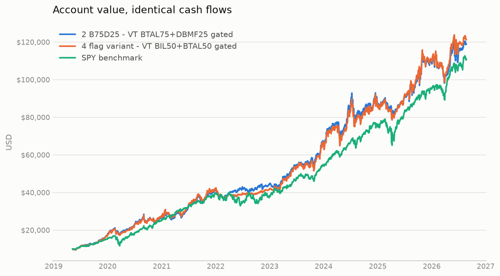
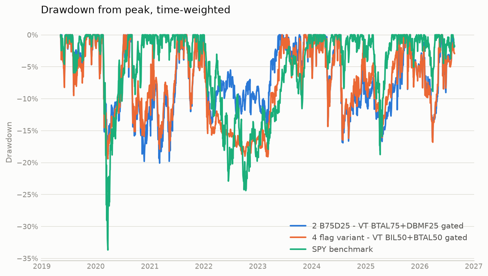
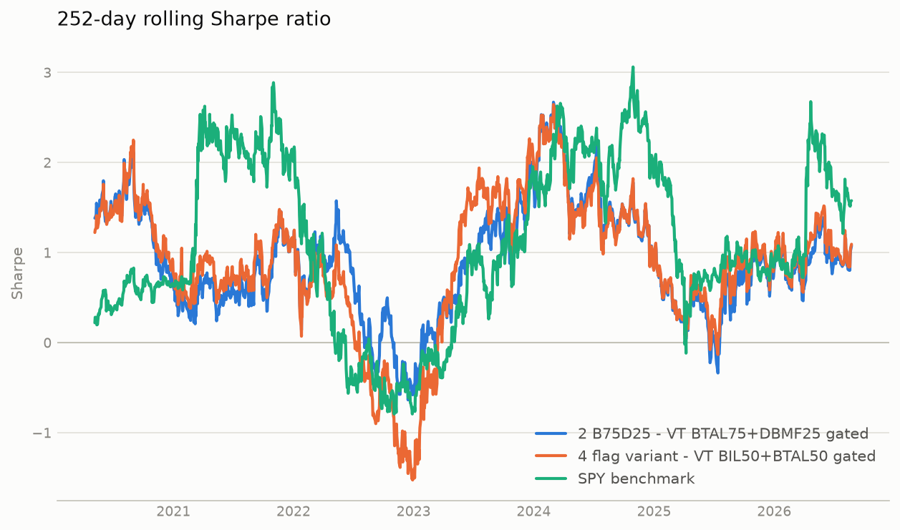
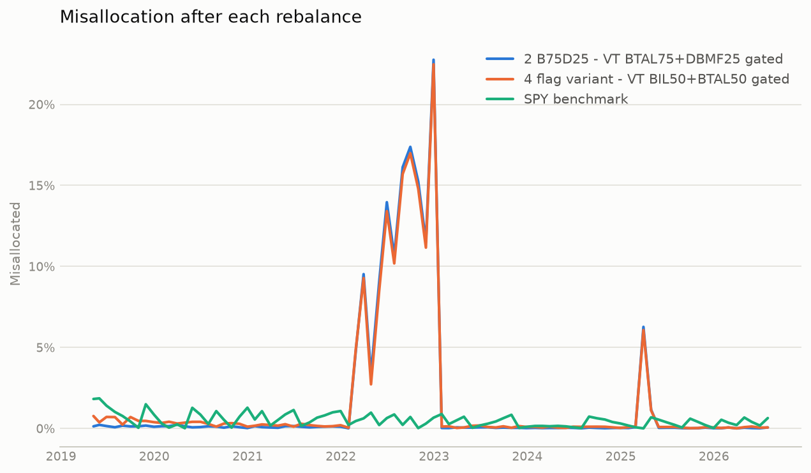

# Portfolio strategy comparison

Simulated 2019-05-08 to 2026-08-24.

| | 2 B75D25 - VT BTAL75+DBMF25 gated | 4 flag variant - VT BIL50+BTAL50 gated | SPY benchmark |
|---|---:|---:|---:|
| Final value | $118,888.68 | $121,221.01 | $110,639.61 |
| Total contributed | $53,500.00 | $53,500.00 | $53,500.00 |
| Net profit | $65,388.68 | $67,721.01 | $57,139.61 |
| Net profit % | +122.22% | +126.58% | +106.80% |
| CAGR (TWR) | +19.13% | +19.20% | +15.94% |
| XIRR (money-weighted) | +18.18% | +18.62% | +16.54% |
| Volatility (annualised) | 21.50% | 21.14% | 19.53% |
| Sharpe | 0.92 | 0.94 | 0.86 |
| Sortino | 1.28 | 1.30 | 1.21 |
| Calmar | 0.95 | 0.99 | 0.47 |
| Max drawdown | -20.07% | -19.41% | -33.68% |
| Max drawdown days | 323 | 141 | 173 |
| Best year | 2023: +34.7% | 2023: +41.2% | 2021: +28.5% |
| Worst year | 2022: -7.6% | 2022: -14.6% | 2022: -18.1% |
| Avg misallocation | 1.67% | 1.72% | 0.52% |
| Max misallocation | 22.76% | 22.47% | 1.86% |
| Avg worst-asset dev | 1.65% | 1.68% | 0.52% |
| Max worst-asset dev | 22.76% | 22.47% | 1.86% |
| Avg weight BIL |  | 0.31 |  |
| Avg weight BTAL | 0.46 | 0.31 |  |
| Avg weight DBMF | 0.15 |  |  |
| Avg weight SPY |  |  | 0.99 |
| Avg weight TQQQ | 0.38 | 0.38 |  |
| Turnover (1-sided, ann.) | 1.65 | 1.67 | 0.07 |
| Total fees | $439.83 | $313.13 | $3.70 |

## Account value

## Drawdown

## Rolling Sharpe

## Imbalance

## Top drawdowns — 2 B75D25 - VT BTAL75+DBMF25 gated

| Peak | Trough | Recovery | Depth | Days |
|---|---|---|---:|---:|
| 2020-09-02 | 2021-03-08 | 2021-07-22 | -20.07% | 323 |
| 2020-02-19 | 2020-03-23 | 2020-07-08 | -18.91% | 140 |
| 2024-07-10 | 2025-04-08 | 2025-09-22 | -18.13% | 439 |
| 2025-10-29 | 2026-03-27 | 2026-06-01 | -16.10% | 215 |
| 2021-11-19 | 2023-03-10 | 2023-05-25 | -14.17% | 552 |

## Top drawdowns — 4 flag variant - VT BIL50+BTAL50 gated

| Peak | Trough | Recovery | Depth | Days |
|---|---|---|---:|---:|
| 2020-02-19 | 2020-03-23 | 2020-07-09 | -19.41% | 141 |
| 2021-11-19 | 2023-03-10 | 2023-06-14 | -19.09% | 572 |
| 2021-01-26 | 2021-05-12 | 2021-07-07 | -18.22% | 162 |
| 2024-07-10 | 2025-04-08 | 2025-08-08 | -17.16% | 394 |
| 2025-10-29 | 2026-03-30 | 2026-05-26 | -16.81% | 209 |

## Top drawdowns — SPY benchmark

| Peak | Trough | Recovery | Depth | Days |
|---|---|---|---:|---:|
| 2020-02-19 | 2020-03-23 | 2020-08-10 | -33.68% | 173 |
| 2022-01-03 | 2022-10-12 | 2023-12-13 | -24.38% | 709 |
| 2025-02-19 | 2025-04-08 | 2025-06-26 | -18.75% | 127 |
| 2020-09-02 | 2020-09-23 | 2020-11-11 | -9.34% | 70 |
| 2026-01-27 | 2026-03-30 | 2026-04-14 | -8.85% | 77 |

- Daily-return correlation, 2 B75D25 - VT BTAL75+DBMF25 gated to SPY benchmark: 0.53
- Daily-return correlation, 4 flag variant - VT BIL50+BTAL50 gated to SPY benchmark: 0.62
