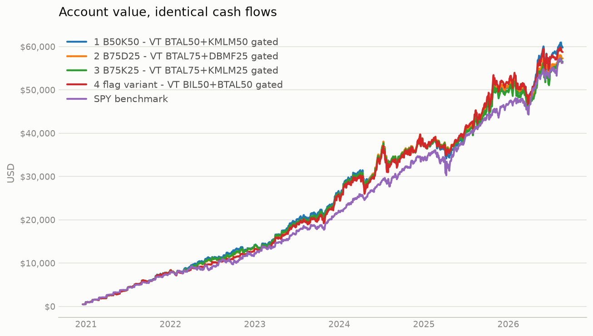
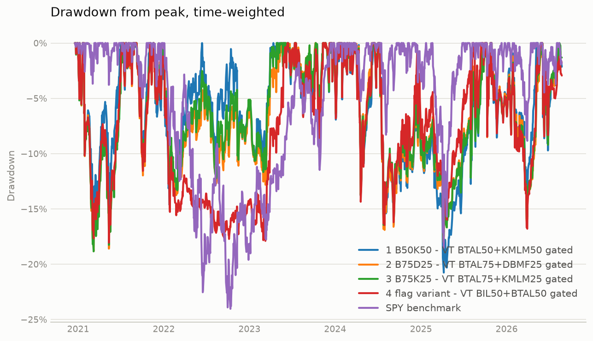
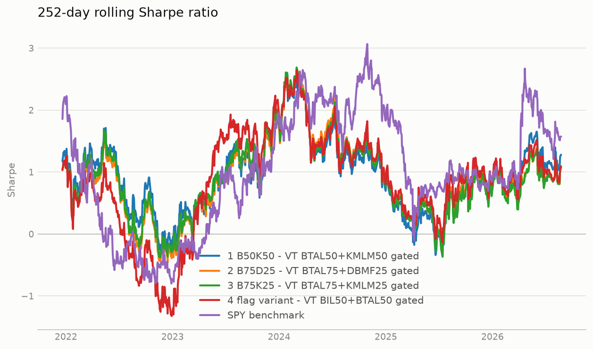
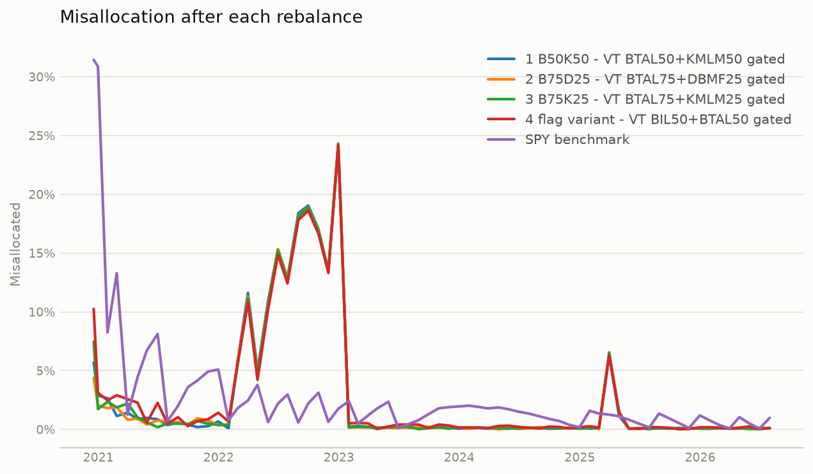

# Portfolio strategy comparison

Simulated 2020-12-18 to 2026-08-24.

| | 1 B50K50 - VT BTAL50+KMLM50 gated | 2 B75D25 - VT BTAL75+DBMF25 gated | 3 B75K25 - VT BTAL75+KMLM25 gated | 4 flag variant - VT BIL50+BTAL50 gated | SPY benchmark |
|---|---:|---:|---:|---:|---:|
| Final value | $59,792.68 | $57,275.80 | $56,558.70 | $58,750.83 | $56,275.54 |
| Total contributed | $34,500.00 | $34,500.00 | $34,500.00 | $34,500.00 | $34,500.00 |
| Net profit | $25,292.68 | $22,775.80 | $22,058.70 | $24,250.83 | $21,775.54 |
| Net profit % | +73.31% | +66.02% | +63.94% | +70.29% | +63.12% |
| CAGR (TWR) | +19.08% | +16.91% | +16.72% | +16.75% | +14.75% |
| XIRR (money-weighted) | +19.14% | +17.62% | +17.18% | +18.52% | +17.00% |
| Volatility (annualised) | 20.96% | 20.33% | 20.08% | 20.17% | 16.32% |
| Sharpe | 0.94 | 0.88 | 0.87 | 0.87 | 0.93 |
| Sortino | 1.31 | 1.22 | 1.22 | 1.22 | 1.35 |
| Calmar | 0.92 | 0.90 | 0.89 | 0.93 | 0.61 |
| Max drawdown | -20.76% | -18.83% | -18.84% | -18.06% | -24.04% |
| Max drawdown days | 448 | 167 | 169 | 162 | 709 |
| Best year | 2023: +37.2% | 2023: +33.9% | 2023: +34.9% | 2023: +40.3% | 2021: +27.4% |
| Worst year | 2022: -2.6% | 2022: -5.6% | 2022: -4.4% | 2022: -12.8% | 2022: -17.9% |
| Avg misallocation | 2.69% | 2.65% | 2.69% | 2.86% | 2.82% |
| Max misallocation | 24.30% | 24.32% | 24.28% | 24.15% | 31.44% |
| Avg worst-asset dev | 2.52% | 2.52% | 2.50% | 2.67% | 2.82% |
| Max worst-asset dev | 24.30% | 24.32% | 24.28% | 24.15% | 31.44% |
| Avg weight BIL |  |  |  | 0.31 |  |
| Avg weight BTAL | 0.31 | 0.47 | 0.47 | 0.31 |  |
| Avg weight DBMF |  | 0.15 |  |  |  |
| Avg weight KMLM | 0.31 |  | 0.15 |  |  |
| Avg weight SPY |  |  |  |  | 0.97 |
| Avg weight TQQQ | 0.38 | 0.38 | 0.38 | 0.38 |  |
| Turnover (1-sided, ann.) | 1.72 | 1.72 | 1.72 | 1.74 | 0.13 |
| Total fees | $187.22 | $162.77 | $183.47 | $116.40 | $2.38 |

## Account value

## Drawdown

## Rolling Sharpe

## Imbalance

## Top drawdowns — 1 B50K50 - VT BTAL50+KMLM50 gated

| Peak | Trough | Recovery | Depth | Days |
|---|---|---|---:|---:|
| 2024-07-10 | 2025-04-08 | 2025-10-01 | -20.76% | 448 |
| 2021-01-26 | 2021-03-08 | 2021-07-02 | -16.01% | 157 |
| 2021-11-19 | 2022-01-27 | 2022-06-13 | -14.75% | 206 |
| 2025-10-29 | 2026-03-27 | 2026-05-08 | -14.52% | 191 |
| 2024-03-22 | 2024-04-19 | 2024-06-12 | -13.81% | 82 |

## Top drawdowns — 2 B75D25 - VT BTAL75+DBMF25 gated

| Peak | Trough | Recovery | Depth | Days |
|---|---|---|---:|---:|
| 2021-01-26 | 2021-03-08 | 2021-07-12 | -18.83% | 167 |
| 2024-07-10 | 2025-04-08 | 2025-09-22 | -18.10% | 439 |
| 2025-10-29 | 2026-03-27 | 2026-06-01 | -16.09% | 215 |
| 2021-11-19 | 2022-02-23 | 2023-05-17 | -13.76% | 544 |
| 2024-03-22 | 2024-04-19 | 2024-06-05 | -13.71% | 75 |

## Top drawdowns — 3 B75K25 - VT BTAL75+KMLM25 gated

| Peak | Trough | Recovery | Depth | Days |
|---|---|---|---:|---:|
| 2021-01-26 | 2021-03-08 | 2021-07-14 | -18.84% | 169 |
| 2024-07-10 | 2025-04-08 | 2025-10-01 | -17.48% | 448 |
| 2025-10-29 | 2026-03-27 | 2026-06-01 | -15.93% | 215 |
| 2024-03-22 | 2024-04-19 | 2024-06-10 | -13.73% | 80 |
| 2021-11-19 | 2022-01-27 | 2023-04-27 | -13.33% | 524 |

## Top drawdowns — 4 flag variant - VT BIL50+BTAL50 gated

| Peak | Trough | Recovery | Depth | Days |
|---|---|---|---:|---:|
| 2021-01-26 | 2021-05-12 | 2021-07-07 | -18.06% | 162 |
| 2021-11-19 | 2023-03-10 | 2023-06-12 | -17.89% | 570 |
| 2024-07-10 | 2025-04-08 | 2025-08-08 | -17.09% | 394 |
| 2025-10-29 | 2026-03-30 | 2026-05-26 | -16.79% | 209 |
| 2024-03-22 | 2024-04-19 | 2024-06-10 | -14.35% | 80 |

## Top drawdowns — SPY benchmark

| Peak | Trough | Recovery | Depth | Days |
|---|---|---|---:|---:|
| 2022-01-03 | 2022-10-12 | 2023-12-13 | -24.04% | 709 |
| 2025-02-19 | 2025-04-08 | 2025-06-26 | -18.52% | 127 |
| 2026-01-27 | 2026-03-30 | 2026-04-14 | -8.84% | 77 |
| 2024-07-16 | 2024-08-05 | 2024-09-19 | -8.29% | 65 |
| 2024-03-27 | 2024-04-19 | 2024-05-14 | -5.25% | 48 |

- Daily-return correlation, 1 B50K50 - VT BTAL50+KMLM50 gated to SPY benchmark: 0.52
- Daily-return correlation, 2 B75D25 - VT BTAL75+DBMF25 gated to SPY benchmark: 0.48
- Daily-return correlation, 3 B75K25 - VT BTAL75+KMLM25 gated to SPY benchmark: 0.46
- Daily-return correlation, 4 flag variant - VT BIL50+BTAL50 gated to SPY benchmark: 0.60
